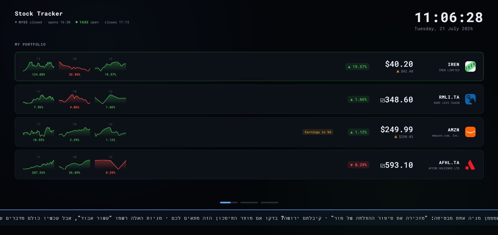
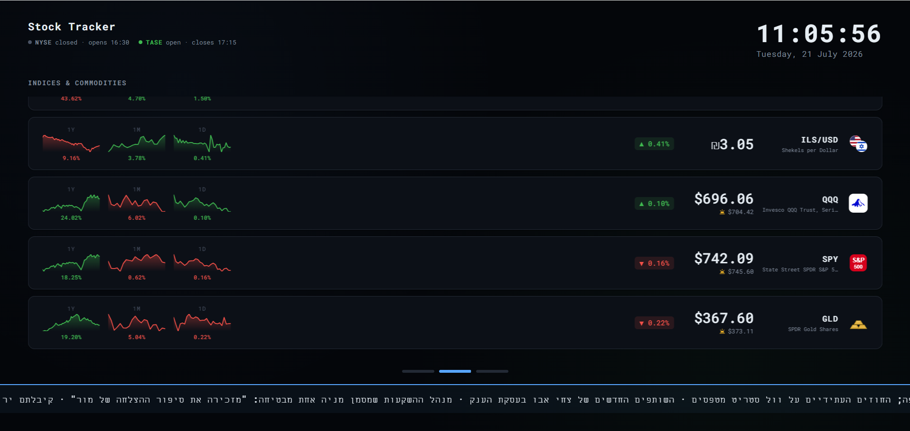
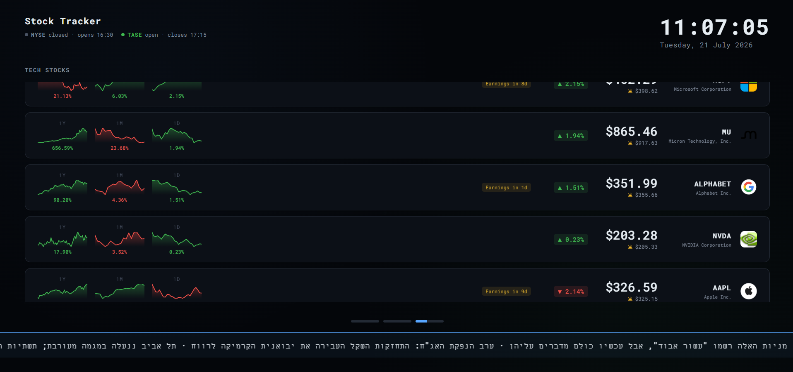

# 📈 Stock Screensaver

A Windows screensaver that turns an idle screen into a live market dashboard —
real-time prices, mini charts, and market news across rotating screens. Built
with React, TypeScript, and Electron, and remotely controllable from Telegram.

> A personal portfolio project.

## Preview

| My Portfolio | Indices & Commodities | Tech Stocks |
|---|---|---|
|  |  |  |

## Features

**Market data**
- Live price, daily change %, and three sparkline charts per stock
  (1-day / 1-month / 1-year), each colored by its own trend
- Pre-market and after-hours prices (☀️ / 🌙) when a US market is outside
  regular trading hours
- 52-week-high and all-time-high indicators
- Upcoming-earnings badges for US tickers
- Handles US stocks, the Tel Aviv Stock Exchange (TASE), crypto, and FX —
  including correct shekel (₪) formatting for TASE prices

**Presentation**
- Rotating screens (portfolio / indices / tech), each auto-sorted by daily change
- Screens that overflow scroll through all their rows within the slide interval
- Live USD/ILS rate, NYSE & TASE open/closed status, and a scrolling
  Hebrew market-news ticker
- Multi-monitor aware — each display shows a different screen, in sync
- Screensaver niceties: near-black OLED-friendly theme, anti-burn-in pixel
  shifting, cursor hiding, and quit-on-input

**Remote control via Telegram**
- Add or remove stocks by messaging a Telegram bot — changes apply to the
  screen live
- Menu-driven (buttons), with every typed ticker validated against Yahoo Finance
- Fully local: no server, no webhook, no cost

## Tech stack

React 19 · TypeScript · Vite · Electron · Node.js · PowerShell (packaging)

## How it works

A few decisions worth calling out:

- **One data source, two transports.** All quotes and history come from Yahoo
  Finance's chart endpoint. In the browser (dev) requests go through Vite's
  dev-server proxy to sidestep CORS; in the packaged app they go through the
  Electron main process over IPC, where CORS doesn't apply. App code calls the
  same `fetchJson` / `fetchText` either way.
- **Live, remotely-editable config.** The stock lists live in a `screens.json`
  file, not the compiled bundle. The Electron main process watches that file and
  hot-reloads changes into the UI — which is how a Telegram message updates the
  display in real time.
- **A bot with no server.** The Telegram bot runs as a small local process and
  long-polls Telegram, so the PC reaches out rather than accepting inbound
  connections — no public server, webhook, or open port required.

## Getting started

### Prerequisites
- Node.js 18+ (developed on Node 24)
- Windows, for the screensaver packaging (the web app itself runs anywhere)

### Develop
```bash
npm install
npm run dev
```
Then open http://localhost:5173.

### Environment (optional)
Earnings badges use Finnhub. Create a `.env` file:
```
VITE_FINNHUB_API_KEY=your_key_here
```
Everything else works without any key.

### Build and install as a screensaver
```bash
npm run electron:build
```
Then install it for the current user (copies to `%LOCALAPPDATA%` and registers
it — no admin needed):
```powershell
powershell -ExecutionPolicy Bypass -File scripts\install-screensaver.ps1
```
Adjust or preview via **Settings → Personalization → Lock screen → Screen saver**.

## Telegram control bot (optional)

Manage the stock list from your phone. Full setup is in
[`bot/README.md`](bot/README.md); in short:

1. Create a bot with [@BotFather](https://t.me/BotFather) and copy the token.
2. Copy `bot/bot-config.example.json` → `bot/bot-config.json` and paste the token.
3. Run `npm run bot`, message the bot to get your chat id, put it in the config,
   and restart.
4. Optionally auto-start it at logon: `scripts\install-bot.ps1`.

## Configuring the stocks

- **From Telegram** — the easiest way; applied live.
- **Defaults** — edit `config/default-screens.json` (seeds new installs).
- **Display tweaks** (logos, ticker labels) live in `src/screens.ts`.

## Project structure

```
src/         React app (renderer)
electron/    Electron main + preload (screensaver shell, IPC)
shared/      Config read/write layer shared by the app and the bot
bot/         Telegram control bot
config/      Default screen definitions
scripts/     PowerShell install scripts
```

## Known limitations

- Yahoo's chart endpoint is unofficial and could change or rate-limit without notice.
- Market open/closed status uses fixed trading hours and ignores exchange holidays.
- Earnings badges (US) and the news ticker (Hebrew) are market-specific.

## License

Personal project. Not currently licensed for reuse.
